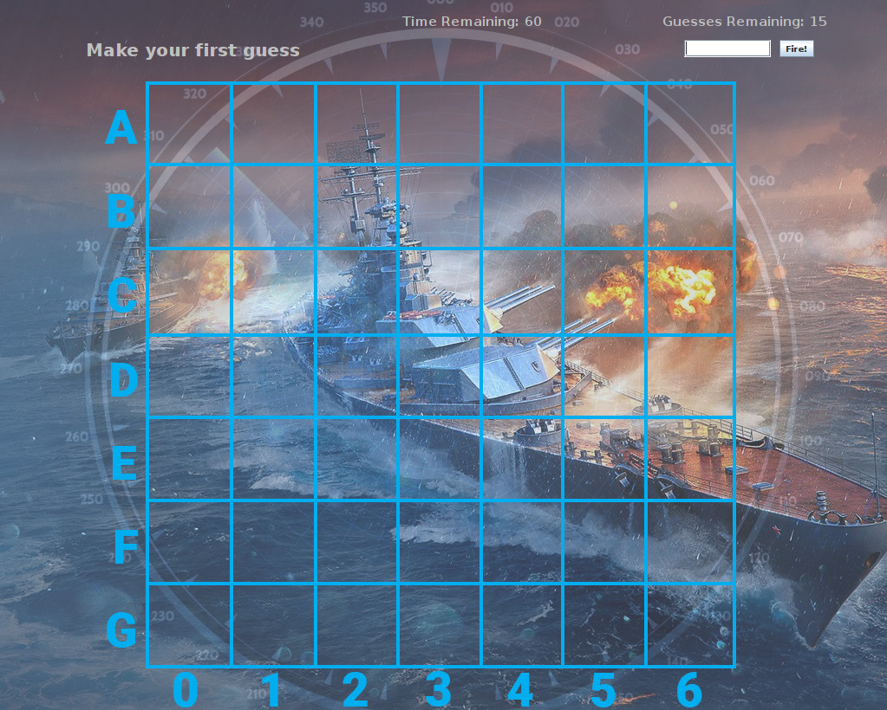

# CSIS 3275 Software Engineering  Programming Project 1  Battleship Game
Battleship Game is a fully functional implementation of the famous 
[Battleship](https://en.wikipedia.org/wiki/Battleship_(game)) game written entirely in Java. It
uses [Swing](https://en.wikipedia.org/wiki/Swing_(Java)) to render the graphical user interface.
The MVC design pattern was used to implement the game.   The **Model** component handles the data and
game logic, creating ships at random locations on the game board and informing a user when they 
have hit or missed a ship based on their guesses. 
The **View** component handles the graphical user interface, updating
the look of the game board as the user progresses through the game. The **Controller** component 
processes guess inputs provided by the user, transforming them into representations understandable 
by the other components of the application.

 

## Relationship between Classes and Method calls
### Setting up the board
When the game starts, the `Battleship` class calls the `main` method which creates an instance of the `BattleshipFrame`
class. The `BattleshipFrame` class sets up the initial UI of the game, creating the board and all the components
needed to interact with it (e.g. guess input, fire button). The `BattleshipFrame` class also creates an instance of
`BattleshipView` and `BattleshipController`. The created instance of `BattleshipController` then creates an instance
of the `BattleshipModel` class.

Inside the `BattleshipModel` class' constructor, two important methods get called:
`populateShipsArray()` and `generateShipLocations()`. `populateShipsArray()` creates an empty string array for each
ship in the game. These include the ship's location as well as its hit flags. `generateShipLocations()` then creates
random ship locations and assigns them to each of the empty string arrays. It calls the `generateShip()` method which
generates random pairs of contiguous numbers from 0-6. These numbers represent the coordinates of a single ship. Before
assigning these numbers however, `generateShipLocations()` calls the `checkCollision()` method to ensure that no two
ships are colliding with one another. If they are, `generateShip()` gets called again. Once there are no more collisions,
the ship locations are assigned, and the game begins.

### Processing a user's guess
To make a guess, the user, types in a letter and number combination in the text field. He/She then clicks the fire button
to register the guess. There is a listener method `actionPerformed()` implemented in the `BattleshipFrame` class that
waits for the fire button to be clicked. Once this happens, the `actionPerformed()` method is called, and it makes a
subsequent call to BattleshipController's `processGuess()` method with the contents of the text field as an argument.

The `processGuess()` method takes the given text and passes it to the `parseGuess()` method. The `parseGuess()` method
takes the text and transforms it into two numbers which represent a set of coordinates on the board. It returns this
set of coordinates to the `processGuess()` method. From there, `processGuess()` updates the number of guesses made and
remaining. It makes a call to BattleshipView's `updateGuesses()` method to make these changes. Next, a call to the
BattleshipModel's `fire()` method is made. The `fire()` method checks if the user's guess falls on one of the ship's
locations. It will either make call to BattleshipView's `displayShip()` or `displayMiss()` method depending on if the
guess was a hit or miss. These methods will add the corresponding hit or miss images on the game board.

The `fire()` method then makes a call to the `isSunk()` method to check if all locations of a
certain ship have been hit. If this is true, a call to BattleshipView's displayMessage() method is made to inform the
user that he/she has sunk an entire ship. Lastly, the `processGuess()` method checks to see if all ships have been sunk
or if the user has no more guesses remaining. If either of these conditions are true, a call to BattleshipView's
`displayMessage()` method is made to inform the user that they have won/lost the game.

## Classes

### Battleship (Application Entry Point)
The main class that launches the entire application.

**Methods**
- **main(String[] args)** - This is the main method that launches the application. It creates a `BattleshipFrame`
  object that sets up the UI and starts the Battleship game.
  
**Properties** 
- none
---
### BattleshipFrame
The class that initializes the UI for the Battleship game. That includes the background image,
text fields, text areas, and buttons.

**Methods**
- **BattleshipFrame()** - Constructor method for the `BattleshipFrame` class. Initializes the UI for the game.
- **actionPerformed(ActionEvent e)** - Takes in an `ActionEvent` object for the user to interact with the application through
  text inputs and button clicks.

**Properties** 
- **int bgWidth** - Predetermined width of the application. Set to 1024.
- **int bgHeight** - Predetermined height of the application. Set to 863.
- **JButton fireButton** - Button a user clicks when they want to make a guess.
- **JTextField guessInput** - Text field into which users input a character followed by a number. This represents 
  their guess on the game board.
- **JTextArea messageLabel** - Text area that displays information to the user. This includes whether they have 
  hit/sunk a ship as well as if they have won or lost the game.
- **JTextArea guessCounter** - Text area that keeps track of how many remaining guesses the user has.
- **JLayeredPane layeredPane** - Layered pane that controls how the UI is organized. 
  Images and text are displayed on the screen in the order defined by the layered pane.
- **BattleshipView view** - A `BattleshipView` object for manipulating the UI and graphics of the game.
- **BattleshipController controller** - A `BattleshipController` object to process the guesses of the user.
  
---
### BattleshipModel
The class that controls game logic. Responsible for setting up the game board with ship placed in random
locations as well as informing the user of the outcome whenever they make a guess.

**Methods**
- **BattleshipModel(BattleshipView view)** - Constructor method for the `BattleshipModel` class.
  It takes in a `BattleshipView` object as its only argument.
- **int getShipsSunk()** - Getter method for the `shipsSunk` property.
- **int getNumShips()** - Getter method for the `numShips` property.
- **void populateShipsArray()** - Populates the `ships` property with empty arrays. It iterates through
  the `numShips` property and adds an array for each ship. Each array contains 2 string arrays, one 
  representing ship locations, and the other representing ship hits.
- **boolean fire(String guess)** - Handles the logic of guess making. Updates a ship's array if it
  has been hit as well as updates the `messageLabel`.
- **boolean isSunk(ArrayList<ArrayList> ship)** - Checks if all 3 squares associated with a single ship
  have been sunk.
- **void generateShipLocations()** - Creates random ship locations for all ships in `numShips`. Calls
  `generateShip` and `checkCollision` until there are no collisions among any of the ships.
- **ArrayList<String> generateShip()** - Create random ship locations for a single ship. Returns
  a string array that contains representations for 3 contiguous squares on the game board.
- **checkCollision(ArrayList<String> shipLocations)** - Checks if there has been a collision in
  any of the current random ship locations.

**Properties** 
- **int boardSize** - The size of the game board. Set to 7 for a total of 49 squares on the board.
- **int numShips** - Number of ships to be placed on the game board. Set to 3.
- **int shipLength** - The number of squares each ship takes up on the game board. Set to 3.
- **int shipsSunk** - Tracks the number of ships the user has sunk.
- **BattleshipView view** - A `BattleshipView` object for manipulating the UI and graphics of the game.
- **ArrayList<ArrayList> ships** - A nested array containing information on ship locations as well as
  whether they have been hit or not.
---
### BattleshipView
The class that controls the view of the game and makes changes to it based on the user's actions.

**Methods**
- **BattleshipView(JLayeredPane layeredPane, JTextArea messageLabel,
  JTextArea guessCounter, JTextField guessInput)** - Constructor method for the `BattleshipView` class.
  Takes in `layeredPane`, `messageLabel`, `guessCounter`, and `guessInput` as arguments. These arguments
  are those that are constantly being updated throughout the course of the game.
- **JLayeredPane getLayeredPane()** - Getter method for the `layeredPane` property.
- **JTextField getGuessInput()** - Getter method for the `guessInput` property.
- **displayMessage(String msg)** - Updates the `messageLabel` text area with the given message.
- **displayShip(String guess)** - Adds a `ship` image on a specific square on the board. 
  Used only when the user hits a ship.
- **displayMiss(String guess)** - Adds a `miss` image on a specific square on the board.
  User only when the user misses a ship.
- **updateGuesses(int guessesLeft)** - Updates the guess counter to reflect how many remaining
  guesses the user has.

**Properties** 
- **JLayeredPane layeredPane** - Layered pane that controls how the UI is organized.
- **JTextArea messageLabel** - Text area that displays information to the user. This includes whether they have
  hit/sunk a ship as well as if they have won or lost the game.
- **JTextArea guessCounter** - Text area that keeps track of how many remaining guesses the user has.
- **JTextField guessInput** - Text field into which users input a character followed by a number. This represents
  their guess on the game board.
- **ImageIcon ship** - Image of a ship to be placed on the game board when a user hits a ship.
- **ImageIcon miss** - Image of the text "MISS" to be placed on the game board when a user misses a ship.
---
### BattleshipController
The class that takes user input and processes it. This class handles the parsing of 
user guesses. 

**Methods**
- **BattleshipController(BattleshipView view)** - Constructor method for the `BattleshipController`
  class. Takes in a `BattleshipView` object as its only argument for manipulating the board view.
- **BattleshipModel getModel()** - Getter method for the `model` property.
- **getGuessesLeft()** - Getter method for the `guessesLeft` property.
- **void processGuess(String guess)** - Processes the guess entered by the user. It checks if the user
  has won or lost the game as well as updates the number of guesses left, and the total guess count.
- **String parseGuess(String guess)** - Parses the guess entered by the user. Maps from a character
  and number format into a set of coordinates representing a square on the board.

**Properties** 
- **int guesses** - Number of guesses the user has made. Set to 0 at the start of the game.
- **int guessesLeft** - Number of remaining guesses the user has before he/she loses the game.
- **BattleshipModel model** - A `BattleshipModel` object for controlling the game's logic.
- **BattleshipView view** - A `BattleshipView` object for manipulating the UI and graphics of the game.
---
